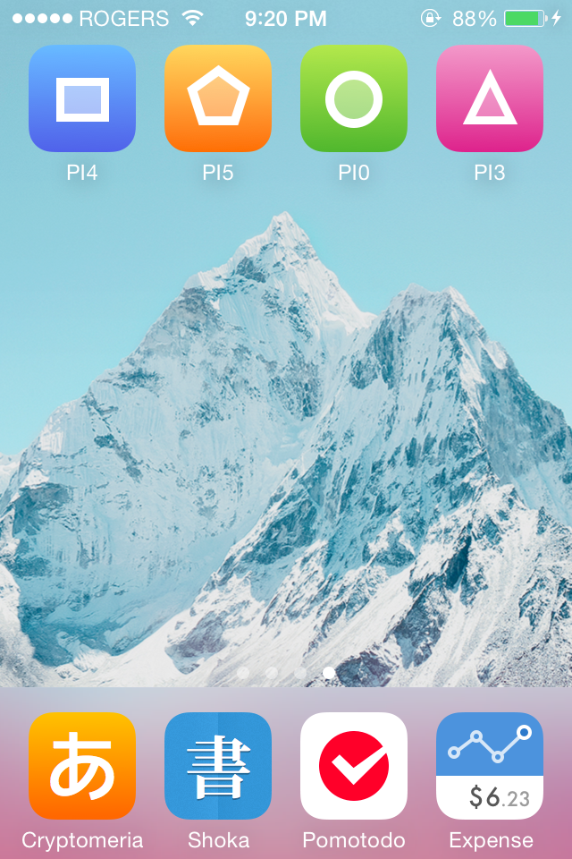

# iOS Prototype Icons

**Preview:** Open these links in Mobile Safari, then add to homescreen: [PI4](https://rawgithub.com/xhacker/iOS-prototype-icons/master/PI4.html) [PI5](https://rawgithub.com/xhacker/iOS-prototype-icons/master/PI5.html) [PI0](https://rawgithub.com/xhacker/iOS-prototype-icons/master/PI0.html) [PI3](https://rawgithub.com/xhacker/iOS-prototype-icons/master/PI3.html)

 
 
 

## Preview
